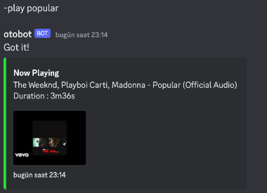
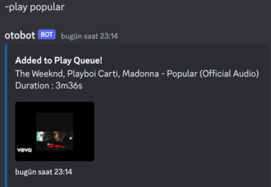
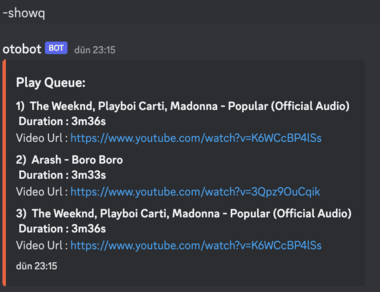

# discord-bot-go

Discord-bot-go is a simple music bot for Discord built in Go, using [discordgo](https://github.com/bwmarrin/discordgo).

It plays music from youtube with using [yt-dlp](https://github.com/yt-dlp/yt-dlp).


## Commands
| Command Name |          Parameter           |                                                                                                 Description                                                                                                 |
|:------------:|:----------------------------:|:-----------------------------------------------------------------------------------------------------------------------------------------------------------------------------------------------------------:|
|    -play     | Search String or Youtube URL | If given parameter is a search string, it searches the string on Youtube and starts to play first found song. If given parameter is Youtube URL, then it starts to play the playlist through the first song |
|   -search    | Search String or Youtube URL |                                                                 It searches the given text or URL on youtube. Then shows first 10 results.                                                                  |
|    -showq    |              -               |                                                                              It shows the play queue(Max queue size : **50**)                                                                               |
|    -skip     |              -               |                                                                                    Plays the next song from play queue.                                                                                     |
|    -stop     |              -               |                                                                                 Stops playing songs and clears play queue.                                                                                  |
|    -help     |              -               |                                                                                   Gives brief explanation about commands.                                                                                   |

## Build & Installation

### Requirements

- [this opus library](https://github.com/hraban/opus) and its dependencies to play audio
- [Ffmpeg](https://github.com/FFmpeg/FFmpeg)
- [yt-dlp](https://github.com/yt-dlp/yt-dlp) to play song from youtube

### Usage

```bash
# Install discord-bot-go
go get -u github.com/puristt/discord-bot-go
```
- discord-bot-go loads necessary tokens from ".env" file. You must create ".env" file like below :

```bash
Youtube_ApiKey={Your_Youtube_Token}
Discord_Token={Your_Discord_Token}
```

- Then you can run the go run command 
```bash
go run main.go
```

### Docker

```bash
# Docker build command
# Do not forget to create .env file
 docker build -t discord-bot-go .
 
# Docker run command
 docker run -d -it otobot
```

## ScreenShots

### -Play Command



### Add to Play Queue



### -Showq Command

